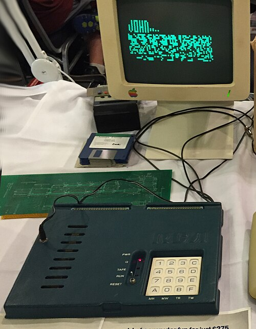

## Introduction
A Guide for beginners to understand and build a Chip-8 Emulator with C-language.

### What is CHIP-8?
CHIP-8 is an interpreted programming language from the mid 1970s to make it easier to program video games on early microcomputers. 

CHIP-8 is essentially a Virtual Machine, similar in concept to the Java Virtual Machine (JVM), but far more basic in design and functionality. With CHIP-8, we can play classic games like Pong, Tetris, Space Invaders, and many others

### History of CHIP-8
CHIP-8 was created in 1977 by RCA engineer Joseph Weisbecker to make it easier to write games on early microcomputers like the [COSMAC VIP](https://en.wikipedia.org/wiki/COSMAC_VIP) and Telmac 1800 which both are 8-bit micro-computers.

<i>Figure 1: RCA COSMAC VIP</i>

 
CHIP-8 was created to make game development easier on early computers. At that time, writing games required a deep understanding of machine code, which was complicated and intimidating for beginners. Instead of programming directly in machine language for the VIP’s CDP1802 processor, developers could enter hexadecimal instructions (using the VIP’s hex keypad) that resembled machine code.

In the 1990's enthusiasts expanded it into [SUPER-CHIP (SCHIP)](http://devernay.free.fr/hacks/chip8/schip.txt) with better graphics and more features. Today even though the original hardware is gone, the CHIP-8 lives through emulators and is a classic first project for anyone learning emulator development for the first time.

##  Why learn CHIP-8
- **Simple & Beginner Friendly** - CHIP-8 has a tiny set of instructions and minimal hardware requirements, making it a perfect first project for learning about low-level programming and emulation.

- **Understanding Emulators** - By building CHIP-8 emulator as a beginner, one can understand how virtual machine works, including memory management, input handling, timers, graphics rendering.

- **Retro Game Development** - As CHIP-8 was designed for simple games, so it helps beginners the fundamentals of game logic, graphics, and inputs easily.

## CHIP-8 Architecture

## Instruction set of CHIP-8

## Classic Games on CHIP-8

## Whats Next??

