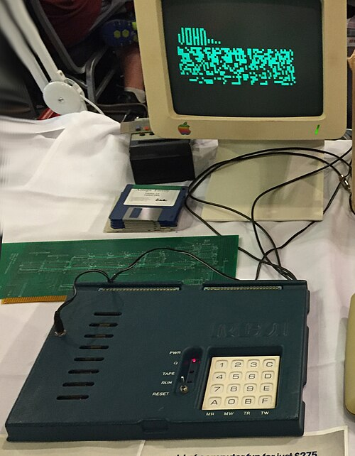

## Introduction
A Guide for beginners to understand and build a Chip-8 Emulator with C-language.

### What is CHIP-8?
CHIP-8 is an interpreted programming language from the mid 1970s to make it easier to program video games on early microcomputers. 

CHIP-8 is essentially a Virtual Machine, similar in concept to the Java Virtual Machine (JVM), but far more basic in design and functionality. With CHIP-8, we can play classic games like Pong, Tetris, Space Invaders, and many others

### History of CHIP-8
CHIP-8 was created in 1977 by RCA engineer Joseph Weisbecker to make it easier to write games on early microcomputers like the [COSMAC VIP](https://en.wikipedia.org/wiki/COSMAC_VIP) and Telmac 1800 which both are 8-bit micro-computers.

<i>Figure 1: RCA COSMAC VIP</i>

 
CHIP-8 was created to make game development easier on early computers. At that time, writing games required a deep understanding of machine code, which was complicated and intimidating for beginners. Instead of programming directly in machine language for the VIP's CDP1802 processor, developers could enter hexadecimal instructions (using the VIP's hex keypad) that resembled machine code.

In the 1990's enthusiasts expanded it into [SUPER-CHIP (SCHIP)](http://devernay.free.fr/hacks/chip8/schip.txt) with better graphics and more features. Today even though the original hardware is gone, the CHIP-8 lives through emulators and is a classic first project for anyone learning emulator development for the first time.

##  Why learn CHIP-8
- **Simple & Beginner Friendly** - CHIP-8 has a tiny set of instructions and minimal hardware requirements, making it a perfect first project for learning about low-level programming and emulation.

- **Understanding Emulators** - By building CHIP-8 emulator as a beginner, one can understand how virtual machine works, including memory management, input handling, timers, graphics rendering.

- **Retro Game Development** - As CHIP-8 was designed for simple games, so it helps beginners the fundamentals of game logic, graphics, and inputs easily.

## CHIP-8 Architecture
The CHIP-8 is not a physical machine but a virtual architecture. Its architecture defines how programs interact with memory, display, and input, giving it the feel of a tiny retro computer.

Key Componenets of the CHIP-8 Architecture are as follows -
 - **Memory** - CHIP-8 has a very tiny amount of memory of _4KB (4096 bytes)_ which it directly takes from the RAM.
 
 - **Resistors** -  CHIP-8 has:
    - **16 8-bit general purpose resistors** ***(V0 to VF)*** - The VF register is used as a flag for tasks like checking for carry or collisions. 
    - **16-bit Index register** - mainly used for storing memory addresses.
    - **16-bit program counter** - Points to the current Instruction.

 - **Stack** - CHIP-8 also has an 8-bit Stack Pointer Registor that is used to handle subroutines.

 - **Timers** - CHIP-8 has 2 timers that runs at 60 updates per seconds.
    - **Delay Timers** - Counts down from a set of values and is used for timing events.
    - **Sound Timers** - Its similar to the Delay timer, but it also makes a beep sound when it's non-zero.
 
 - **Input** - The input system uses a 16-key hexadecimal keypad (0x0 to 0xF). These keys are often mapped to different game actions.
 

 <table>
  <tbody>
    <tr>
      <td><kbd>1</kbd></td>
      <td><kbd>2</kbd></td>
      <td><kbd>3</kbd></td>
      <td><kbd>4</kbd></td>
    </tr>
    <tr>
      <td><kbd>Q</kbd></td>
      <td><kbd>W</kbd></td>
      <td><kbd>E</kbd></td>
      <td><kbd>R</kbd></td>
    </tr>
    <tr>
      <td><kbd>A</kbd></td>
      <td><kbd>S</kbd></td>
      <td><kbd>D</kbd></td>
      <td><kbd>F</kbd></td>
    </tr>
    <tr>
      <td><kbd>Z</kbd></td>
      <td><kbd>X</kbd></td>
      <td><kbd>C</kbd></td>
      <td><kbd>V</kbd></td>
    </tr>
  </tbody>
</table>

 
 - **Display** - CHIP-8 has a resolution of 64×32 pixels *monochrome* (black & white) display, in which Graphics are drawn using 8×N *sprites*, where N is the sprite height, up to 15. These drawing uses XOR logic, which makes collision detection automatic.
 
 - **Instruction Set** - The CHIP-8 instruction set is a colection of about 35 simple, 2-byte instructions that control program flow registers, memory, graphics, input, timers and sound in the CHIP-8 VM.

## Instruction set of CHIP-8
In CHIP-8, Each instruction is 2-bytes in size, and consists of opcode (operational code) and potential arguments. The instruction set is divided into several groups, each designed for specific purposes:
 - **System Instructions** - Handles low-level operations such as jumping and returning from subroutines.
 - **Flow Control Instructions** - Manages the Control flow of the program.
 - **Arithmatic and Logical Instructions** - These instructions performs calculations and bitwise operations. They include setting register values, adding/subtracting with optional carry/borrow flags, and bitwise AND, OR, XOR operations.
 - **Memory Operations Instructions**-  Allow programs to manipulate CHIP-8's memory. They include loading/storing values from/to memory locations, adjusting the index register, and working with binary-coded decimal (BCD) representations of numbers.
 - **Display and Graphics** - Controls the CHIP-8's simple graphical system enabling drawing sprites at specific coordinates and handles pixel collision detection.
 - **Input Handing** - Manages the inputs from CHIP-8's hexadecimal keypad. 
 - **Timers and Sound** - Allows the program to set or read these timers, making them essential for synchronization and simple game sound effects.

## Classic Games on CHIP-8
Many hobbyists recreated arcade-style titles in CHIP-8 form, giving the platform a small but iconic library of "classic" games.
Some of the well known CHIP-8 classic games includes.

- **Pong** - Two player paddle and ball game
- **Space Invaders** - A simplifies version of the arcade shooter.
- **Tetris** - The iconic falling block puzzle
- **Blinky** - Maze style chase game 
- **Blitz** - Drop bombs to clear buildings for a plane to land.

### Further Reading
For a detailed description of the CHIP-8 I suggest you to look at the technical guide: [<u>Cowgod's CHIP-8 Technical Reference</u>](http://devernay.free.fr/hacks/chip8/C8TECH10.HTM)