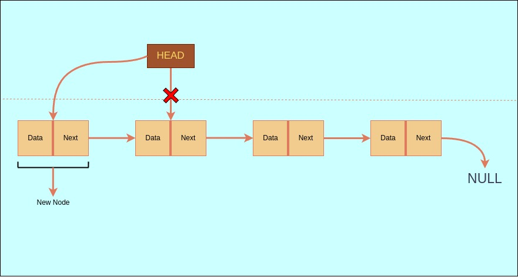
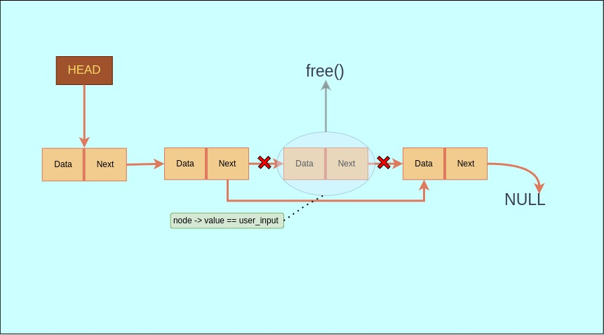

### What is a Linked List ??
A **linked list** is a dynamic data structure used to store a sequence of elements. Unlike arrays, linked lists do not store elements in contiguous memory locations. Instead, each element, known as a node, consists of two parts: Data and a Pointer to the next Node.

### Components of a Linked List

Linked lists consists of 3 components :-

- **Node**: A node is the building block of a linked list. it further consists of two parts, which are:-

    - **Data**: A variable containing the value of the node

    - **Next**: A pointer pointing to the next node.

- **Head**: The head is a pointer variable which points to the first node of the list.

- **Tail**: The last node of the list, which points to null.

## Structure of the linked list


### Making the structure of the Linked list.
Code for making the structure of linked list.
```C
//Structure of Linked list.
typedef struct node{
	int value;
	struct node *next;
}Node;
```

In the above code, we have made a structure which consist of 2 variables: value and next. The value is of type int, so it will store integer values, and the next variable is a pointer variable which is a pointer which will point to next node (if present) or NULL.

## Basic operations with Linked Lists

### Insertion

In this operation we will learn how to add more nodes to the Linked list. There are several ways by which we can do that:-

- **Insertion at head -**

Insertion at head means to make a new node and add it at the beginning of the linked list i.e. make the new node the first node of the list. And make the head point to the new node and the new node to the node which was previously pointed by the head.

Refer to the picture below for better understanding.


As you can see in the above picture we’ve inserted a new node and made the head now pointing the new node. Lets see how we can write it in C language:

```C
#include <stdio.h>
//Function for inserting new node at the starting of the list.
Node *insert_at_head(Node *head,int new_value){
	Node *newnode = calloc(1,sizeof(Node));	
	newnode -> value = new_value;
	
	if (head == NULL) return newnode;
	else{
		newnode -> next = head;
		return newnode;
	}
}

void main(){
	Node *list1_head = NULL;
	
	list1_head = insert_at_head(list1_head, 2);
	
	print_node(list1_head); //we will learn to print nodes later.
}
```

- **Insertion at tail -**
In this, we make a new node and insert it after the last node of the linked list. And Modify the previous tail node to the new node.


We can write it in codes as -
```C
#include <stdio.h>

//Function for inserting new tail node.
Node *insert_at_tail(Node *head,int new_value){
	Node *new_node = calloc(1,sizeof(Node));	
	new_node -> value = new_value;
	
	if (head == NULL) return new_node;
	else{
		Node *current = head;
		while (current -> next != NULL) current = current -> next; 
		current -> next = new_node;
		return head;
	}
}

void main(){
	Node *head = NULL;
	
	head = insert_at_tail(head, 2);
	head = insert_at_tail(head, 4);

	print_node(head);
}
```

- **Insertion after any node.**
In this, we take a new node value and a node after which we want to place the new node. And place the new node after that node and make that node point the new node and the new node point the next node.

Like this,


We can write this in C language as…
```C
#include <stdio.h>
#include <stdlib.h>

//Function for inserting new nodes between 2 nodes.
Node *insert_after(Node *head, int new_value, int after_value){
	Node *new_node = calloc(1, sizeof(Node));
	new_node -> value = new_value;
	
	if (head == NULL) return new_node;
	else{
		Node *current = head;
		while (current -> next != NULL){
			if (current -> value == after_value){
				new_node -> next = current -> next;
				current -> next = new_node;
				return head;
			}else current = current -> next;
		}
		new_node -> next = current -> next;
		current -> next = new_node;
		return head;
	}

}


void main(){
	Node *head = NULL;
	
	head = insert_at_tail(head, 2);  //function not included in this code.
	head = insert_at_tail(head, 4);  //function not included in this code.
    head = insert_at_tail(head, 6);  //function not included in this code.
    head = insert_at_tail(head, 8);  //function not included in this code.
    head = insert_at_tail(head, 10); //function not included in this code.
    head = insert_at_tail(head, 12); //function not included in this code.
		
	printf("List before insertion:");
	print_node(head);                //function not included in this code.
	
	printf("List after insertion:");
	insert_after(head, 20, 6);
	print_node(head);
}

/*Output
List before insertion:Node 0 = 2
Node 1 = 4
Node 2 = 6
Node 3 = 8
Node 4 = 10
Node 5 = 12
List after insertion:Node 0 = 2
Node 1 = 4
Node 2 = 6
Node 3 = 20
Node 4 = 8
Node 5 = 10
Node 6 = 12
*/
```

### Deletion
Deletion here means to delete a remove a node from a linked list and free its memory with the use of the free() function. Some ways of deletion are as follows:

- **Deletion at head**
It means to delete the first node of the linked list, and modify the head to point the next node.


```C
#include <stdio.h>
#include <stdlib.h>

//Function for deleting the head of linked list.
Node *delete_head(Node *head){
	if (head == NULL) return NULL;
	else{
		Node *to_return = head -> next;
		free(head);
		return to_return;
	}
}

void main(){
	Node *list1_head = NULL;
	
	list1_head = insert_at_head(list1_head, 2);
	
	print_node(list1_head);
}
```


- **Deletion at tail.**

Deleting the last node of the linked list. We have to just free the last node and we’re done.


Here is the code for doing that,
```C
#include <stdio.h>
#include <stdlib.h>

// Function for deleting the tail node of linked list.
Node *delete_tail(Node *head) {
    if (head == NULL) return NULL; // Empty list.
    if (head->next == NULL) {      // Only one node in the list.
        free(head);
        return NULL;
    }
    Node *current = head;
    while (current->next->next != NULL) {
        current = current->next;
    }
    free(current->next);
    current->next = NULL;
    return head;
}

void main() {
    Node *list1_head = NULL;

    list1_head = insert_at_head(list1_head, 3);
    list1_head = insert_at_head(list1_head, 2);
    list1_head = insert_at_head(list1_head, 1);

    printf("Linked list before deleting tail:\n");
    print_node(list1_head);

    list1_head = delete_tail(list1_head);

    printf("\nLinked list after deleting tail:\n");
    print_node(list1_head);
}
```


- **Deleting first matching element**
In this we’ll take an input from the user and delete the matching node from the linked list. if no node matches the input then it will delete nothing.


lets write a code for that,
```C
#include <stdio.h>
#include <stdlib.h>

//Function for First Matching Node.
Node *delete_first_match(Node *head, int delete_value, bool *was_deleted){
	if (head==NULL){
		*was_deleted = false;
		return NULL;
	}
	
	if (head->value == delete_value){
		Node *temp = head->next;
		free(head);
		*was_deleted = true;
		return temp;
	}
		
	Node *current = head->next;
	Node *prev = head;
	
	while (current != NULL){
		if (current -> value == delete_value){
			prev->next = current -> next;
			free(current);
			*was_deleted = true;
			return head;	
		}
		
		prev = current;
		current = current -> next;
	}
	*was_deleted = false;
	return head;
}

void main() {
	Node *head = NULL;

	head = insert_at_head(head, 7);	
        head = insert_at_head(head, 5);
        head = insert_at_head(head, 3);
        head = insert_at_head(head, 6);
        head = insert_at_head(head, 1);
        head = insert_at_head(head, 3);
        head = insert_at_head(head, 2);
        head = insert_at_head(head, 8);
    
    int del_num;
    printf("Enter a number to delete:");
    scanf("%d",&del_num);

	printf("List before Deletion\n");
	print_Node(head);
	
	bool deleted;
	head = delete_first_match(head,del_num,&deleted);
	
	if (deleted){
		printf("List after Deletion:\n");
		print_Node(head);
	}else{
		printf("value not found:\n");
	}
}

/*Output
Enter a number to delete:3
List before Deletion
Node 1 = 8
Node 2 = 2
Node 3 = 3
Node 4 = 1
Node 5 = 6
Node 6 = 3
Node 7 = 5
Node 8 = 7
List after Deletion:
Node 1 = 8
Node 2 = 2
Node 3 = 1
Node 4 = 6
Node 5 = 3
Node 6 = 5
Node 7 = 7
*/
```

### Traversing

**Traversing** a linked list means accessing and processing each node of the linked list exactly once, starting from the head node and following the links (pointers) to reach each subsequent node until the end.

- **Printing nodes**
A very simple use of traversing a linked list is Printing all the nodes. Lets see how we can traverse our linked list and print each node’s data.

```C
#include <stdio.h>

//Function for printing a Node.
void print_Node (Node *head){
	Node *current;
	current = head;
	
	int i = 1;
	
	while (current != NULL){
		printf("Node %d = %d\n", i,current->value);
		i++;
		current = current -> next;
	}
}

void main() {
	Node a,b,c;

	a.value=5;
	a.next=&b;

	b.value=10;
	b.next=&c;

	c.value=15;
	c.next=NULL;	
	
	print_Node(&a);
}

/*Output
Node 1 = 5
Node 2 = 10
Node 3 = 15 
*/
```

## Why use Linked Lists rather than Arrays ??

Linked lists are often preferred over arrays in dynamic memory allocation like arrays, which have a fixed size, linked lists are dynamic structures that grow or shrink as needed without requiring contiguous memory blocks.

### Advantages of Linked Lists over Arrays :

**Dynamic Size:**
In Linked lists we can dynamically adjust their size during runtime of the program, instead of declaring a fixed size at the beginning.

**Efficient Insertions/Deletions:**
Inserting or deleting elements in a linked list is more efficient than array as it requires updating pointers, while arrays require shifting elements.

**No Wasted Space:**
Linked lists do not require reserving extra memory in the beginning, unlike arrays which might have unused elements if their size is estimated more.

**Non-Contiguous Memory Allocation:**
Linked lists do not require memory to be allocated in a single block, making them more adaptable for dynamic memory allocation.

## Source Code:-

🧠 Now that you've seen how the linked list works, you can check out the complete code here:
🔗 [View Full Source Code on GitHub](https://github.com/0xAKD/linked-list-c)